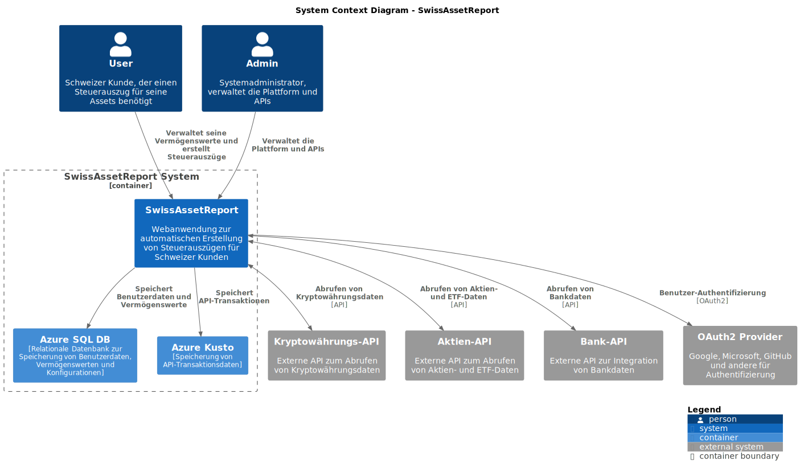
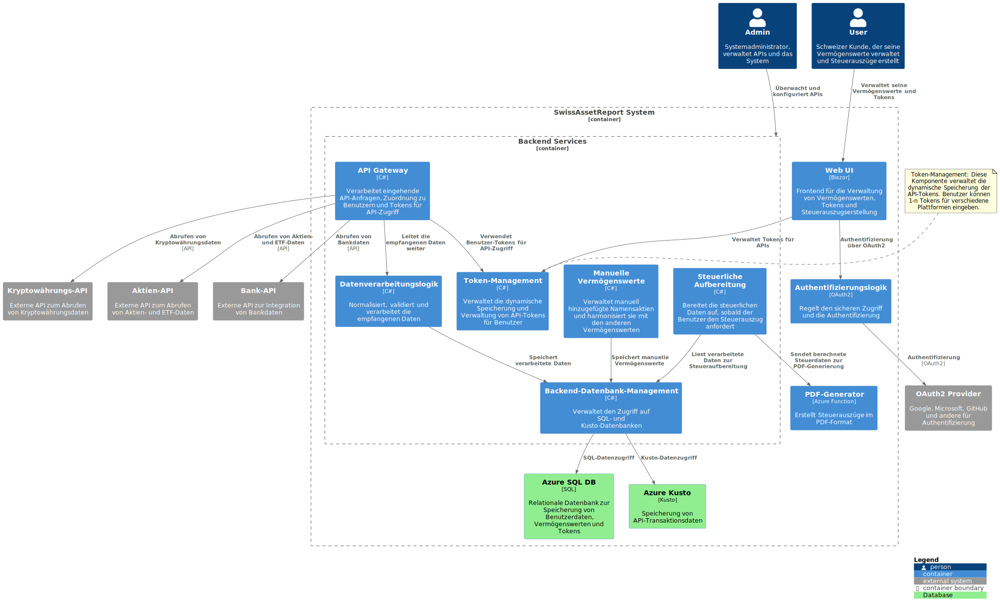
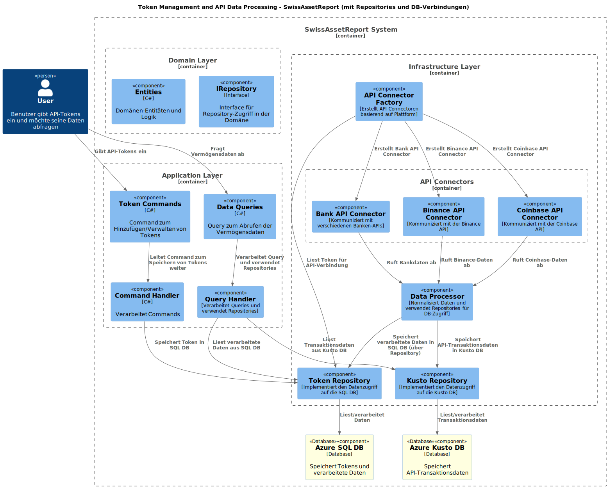
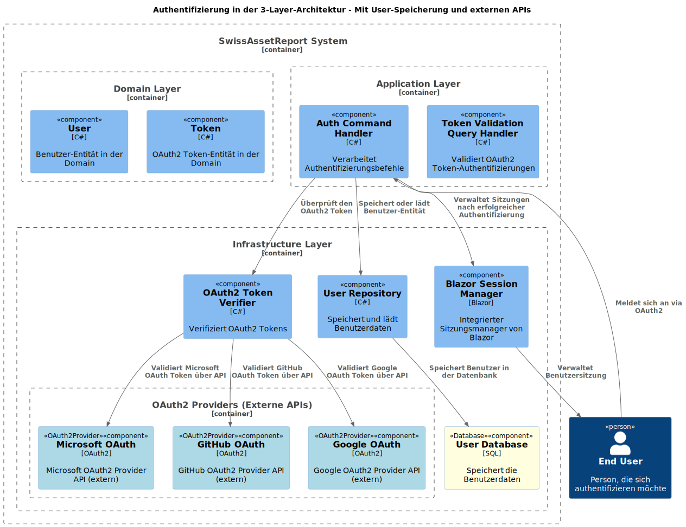
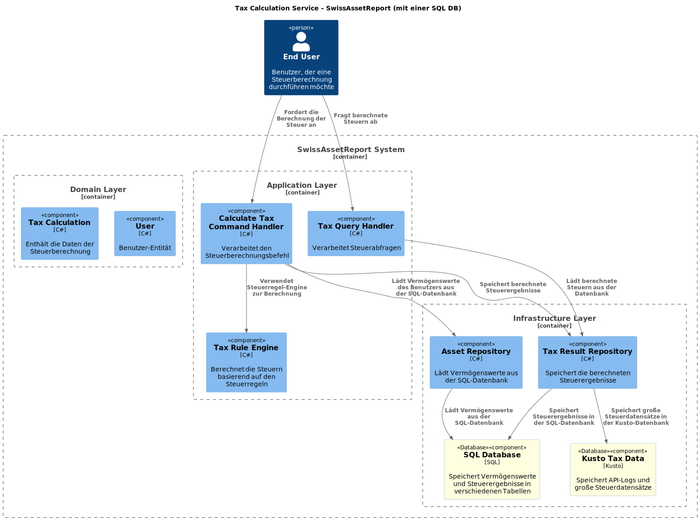

# SwissAssetReport

## Beschreibung:
SwissAssetReport ist eine innovative Webanwendung, die es Schweizer Kunden ermöglicht, einen automatisierten Steuerauszug über alle ihre Vermögenswerte (Assets) zu generieren, unabhängig davon, ob es sich um Kryptowährungen, Aktien oder andere Anlageformen handelt. Die Plattform vereinfacht den Steuerprozess, indem sie verschiedene APIs von Handelsplattformen integriert, um sämtliche relevanten Daten zu sammeln, zu berechnen und gemäß den gesetzlichen Anforderungen in einem übersichtlichen PDF-Format auszugeben.

## Funktionen:

**Automatisierte Datenintegration über APIs:**

SwissAssetReport nutzt die APIs von verschiedenen Plattformen (z. B. Kryptobörsen, Investmentplattformen, Banken), um automatisch alle relevanten Daten zu den Vermögenswerten des Nutzers abzurufen. Dies umfasst z. B. Kryptowährungen, ETFs, Aktien, und andere Investmentprodukte.

**Manuelle Hinzufügung von Vermögenswerten:**

Benutzer können Vermögenswerte, die nicht über APIs integriert werden können (z. B. Namensaktien, private Beteiligungen, physische Güter), manuell hinzufügen, um den Auszug zu vervollständigen.

**Verstecken von Vermögenswerten:**

Die Plattform bietet die Möglichkeit, bestimmte Vermögenswerte im Endauszug zu "verstecken", sodass sie nicht in der finalen PDF-Version angezeigt werden, während sie weiterhin für den Benutzer sichtbar und verwaltbar bleiben.

**Automatisierte Berechnungen nach Vorschriften:**

Alle Daten werden gemäß den aktuellen Schweizer Steueranforderungen berechnet und aufbereitet, sodass der Nutzer sicher sein kann, einen konformen Steuerauszug zu erhalten.

**Generierung eines PDF-Steuerauszugs:**

Nach der automatisierten Datenverarbeitung wird ein umfassender und detaillierter Steuerauszug im PDF-Format generiert, der dem Nutzer zur Verfügung gestellt wird.

**Benutzerfreundliche Oberfläche:**

Eine intuitive Benutzeroberfläche ermöglicht es den Nutzern, ihre Vermögenswerte einfach zu verwalten, den Fortschritt ihrer Steuerdokumente zu verfolgen und Anpassungen vorzunehmen.
Mehrwert: SwissAssetReport bietet einen erheblichen Mehrwert für Schweizer Steuerzahler, indem es den gesamten Prozess der Steuerberichterstattung für Vermögenswerte automatisiert und vereinfacht. Der Benutzer spart Zeit und Mühe bei der manuellen Erfassung seiner Vermögenswerte und kann sicher sein, dass seine Steuerdokumente korrekt und vollständig sind. Zudem bietet die Möglichkeit, Assets zu verstecken, eine flexible Lösung, die auf individuelle Bedürfnisse zugeschnitten ist.

## Zielgruppe:
Schweizer Bürger, die in verschiedene Vermögenswerte investiert haben, darunter Kryptowährungen, Aktien, ETFs und andere Anlagen, und die eine einfache, automatisierte Lösung für ihre Steuererklärungen suchen.

## System Context Diagram

System Context Diagramm für SwissAssetReport:

## Container Diagram

Container Diagramm für SwissAssetReport:

## Component Diagramm's
### Token and API

### Auth with external API's

### TaxCalc
**IN PROGRESS**
- Vielleicht kann auch ein bischen Tax Logic in den Domain Layer,... wie fix ist das alles?
- vielleicht gibt es auch eine offizielle TaxCalc API,.. dann müsste weniger selber gepflegt/Aufbereitet werden.

